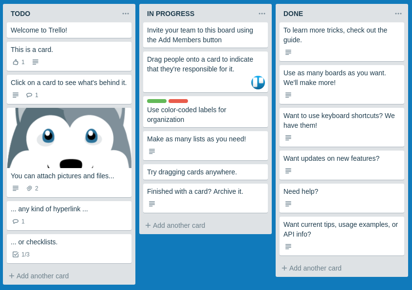
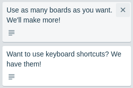

### Trello

#### Легенда

deployment: https://marinaustinovich.github.io/ahj-homeworks-dnd-Trello/
Вы делаете внутрикорпоративную систему управления задачами, и вашему руководству очень нравится подход, который используется в [Trello](https://trello.com):

#### Описание

Фактически есть доска, состоящая из колонок. В каждой колонке может быть несколько карточек.

Для упрощения сделаем следующие допущения:
1. Количество колонок фиксировано и равно 3.
2. Новые колонки добавлять нельзя, удалять имеющиеся тоже.
3. Перемещать колонки нельзя.

Можно:
1. Добавлять карточки с помощью кнопки 'Add another card'. Это выглядит так:

2. Удалять карточки: при наведении на карточку появляется иконка крестик ("\E951"), которая и удаляет карточку. Обратите внимание, что в оригинальном Trello такой операции нет, есть только архивация. Для упрощения её ввели:

 
4. Перемещать карточки как внутри колонки, так и между колонками:

##### Процесс перемещения

1. Внешний вид до переноса — карточка находится на своём месте:

1. Внешний вид в момент переноса — карточка удаляется из своего начального положения:

Следующие нюансы:
1. Внешний вид курсора ('grabbing').
2. Курсор по отношению к карточке остаётся там, где изначально схватили: не привязывается ни к левому краю, ни к центру, а там, где схватили карточку, т. е. можно схватить за нижний левый угол:

3. При наведении на другие позиции под карточку выделяется место по высоте, равное размеру самой карточки. Будет ли карточка ставиться до или после элемента, — это определяется исключительно позицией курсора:

##### Дополнительно

Дополнительные требования:
1. Хранить всё состояние в LocalStorage так, чтобы после обновления страницы внесённые изменения сохранялись.
1. Постоение DOM-дерева производиться на базе состояния, хранящегося в LocalStorage.

##### Упрощения

В целях упрощения сделано только:
1. Возможность хранить текст. Картинки, списки, цветовое оформление элементов не нужно.
2. Перемещение самой карточки. Поворот делать не нужно.
3. Не обрабатана ситуация, связання с выносом элемента за пределы доски.
